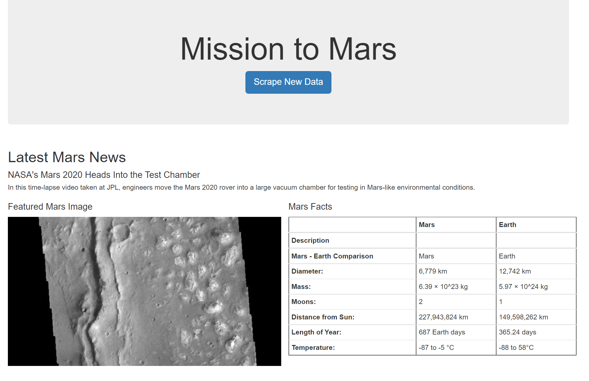
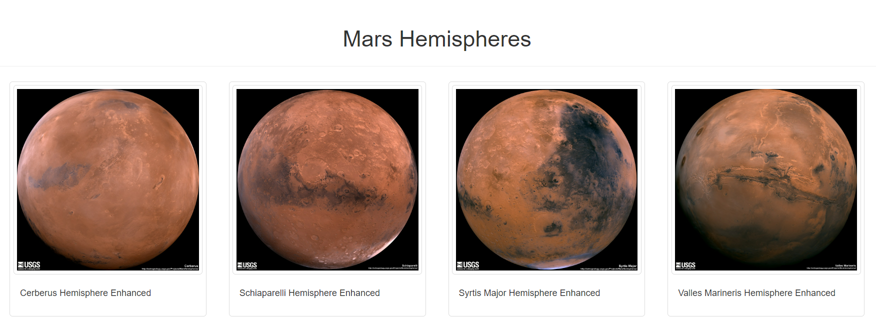
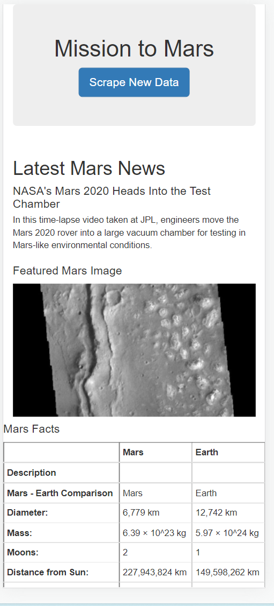
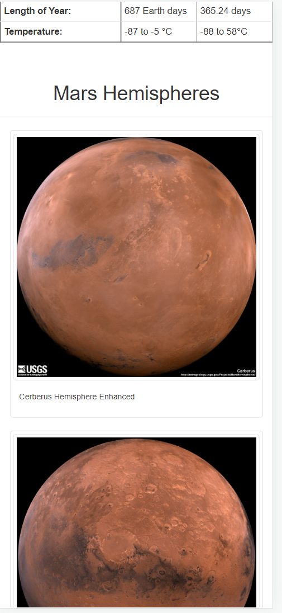
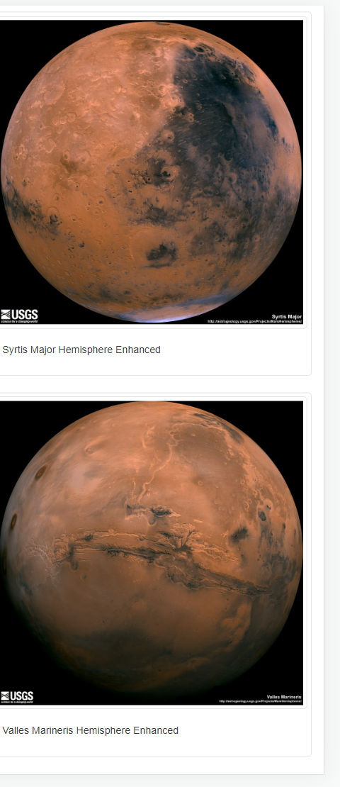

# Mission-to-Mars

## Overview
This project aims to use web scraping to collect the latest data about Mars and create a responsive web page to present the data. This analysis used Jupyter Notebook, Splinter, BeautifulSoup, Flask, and Bootstrap.

## Sources
Information was scraped from various websites:
 - News were retrivied from [https://redplanetscience.com/](https://redplanetscience.com/)
 - Mars Facts from [https://galaxyfacts-mars.com](https://galaxyfacts-mars.com)
 - Featured Images from [https://spaceimages-mars.com](https://spaceimages-mars.com)
 - Hemisphere Images from [https://marshemispheres.com/](https://marshemispheres.com/)

## Results

- Visualisation on the computer browser

    

    

- Visualisation on a mobile device

    
    
    